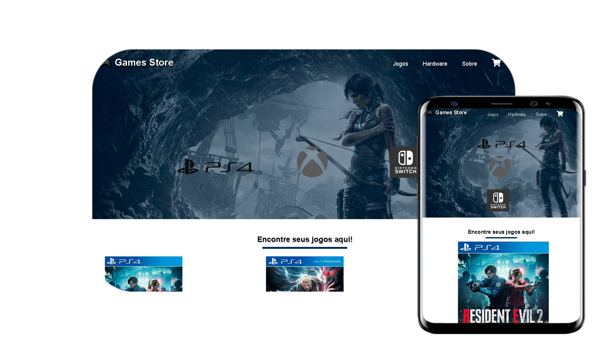

# GamesStore - HTML & CSS

## Página Principal

    
    
Página HTML <i>desktop</i> e <i>mobile</i>

Esta página é a página de introdução, onde o usuário visualiza e seleciona o produto por sua categoria.

## Página de Abertura

    
    
Página HTML <i>desktop</i> e <i>mobile</i>

Esta não é a página principal mas a página introdutória.

## Página com todos os produtos

    
    
Página HTML <i>desktop</i> e <i>mobile</i>

Esta página exibe para o usuário todos os produtos da GameStore.

